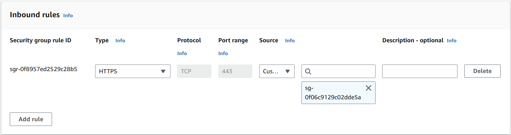

# <a name="top"></a>SettingUps
Create a VPC with 3 diffrerent AZs (optional - for high availability), configure EC2 instance, IAM user, and Security group for instance and services.

## Table of Contents
* [Creating an IAM User](#iam-user)
* [Creating a new VPC](#vpc)
* [Creating Security Groups](#security-group)
* [Launch an EC2 Instance](#ec2-launch)
* [Configuring EC2 Instance](#ec2-user-configuration)

## <a name="setting-up-overview"></a>Setting Up Architecture


## <a name="iam-user"></a>Creating an IAM User
1. Log in to the AWS Management Console and access the IAM service.
2. Create a new **Users**  and give full access **Programmatic access** and **AWS Management Console access**.
3. Click the **\[Next: Permissions\]** button, and attach existing **AdministratorAccess** privileges policies.
4. Download credentials and Login to the new user Management console.
5. generate access key information


## <a name="vpc"></a>Creating a new VPC
1. Log in to the AWS Management Console and select VPC 
2. Select **Create new VPC** to start the VPC creation wizard
3. Follow the creation wizard to create a new VPC with 3 AZs in the same Region (I'm using us-east-2 Ohio).
*In this lab I only use 1 AZ to host my instance. VPC is set up across different AZs, further implementations(autoscaling, ALB,...) could be implemented to ensure a high availability deployment.*


## <a name="security-group"></a>Creating Security Groups
1. Navigate to the EC2 service in the AWS Management Console.
2. Select the **Security Groups** item from the **NETWORK & SECURITY** menu.
3. Click **\[Create Security Group\]**.
4. Configure necessary rule for the **Security Group**, and then **\[Create\]** a new security group.
Rules as follow:
### Security Groups to the EC2 instance as a bastion host
**Inbound** rule of this security group allow SSH connection to the Bastion host

### Security Groups created for use in Elasticsearch Service
**Inbound** rule allowing traffic from OpenSearch service security group.

### Security group for an es cluster
 **Inbound** rule allowing traffic from use-es-sg created earlier


## <a name="ec2-launch"></a>Launch an EC2 Instance
Create an EC2 instance that will generate the data needed for the lab in real time.
This instance is created in public subnet of one AZ for simplicity and advoid unecessary charges.
1. Connect to EC2 service in AWS Management Console.
2. In the upper right, select your region (e.g., **Ohio**).
3. Select **Instances** from the left **INSTANCES** menu and click **\[Launch Instance\]** to start creating a new instance.
4. Instance configurations as follow: 
    + Intance Image: `Amazon Linux 2023, SSD Volume Type`
    + Instance Type: `t2.micro` 
    + Instance VPC: `lab-vpc`
    + Subnet: `public-subnet-1`
    + Security Group: Assign security groups `Bastion`, `es-use-sg`
    + Key pair access: Create a new key pair named `analytics-hol`to connect using PuTTY

## <a name="ec2-user-configuration"></a>Download neccessary file and configure the EC2 Instance
Configure the EC2 instances to access and control other AWS resources as follows:
1. [Use PuTTY to connect to your Linux instance from Windows](https://docs.aws.amazon.com/AWSEC2/latest/UserGuide/putty.html).
2. Perform the following actions in order on the EC2 instance connected vis SSH, specified ec2-user
    (1) Download the lab source code. 
    ```shell script
    wget 'https://github.com/aws-samples/aws-analytics-immersion-day/archive/refs/heads/main.zip'
    ```
    (2) Extract the downloaded source code.
    ```shell script
    unzip -u main.zip
    ```
    (3) Grant execution authority to the practice environment setting script.
    ```shell script
    chmod +x ./aws-analytics-immersion-day-main/set-up-hands-on-lab.sh
    ```
    (4) Execute the setup script to set the lab environment.
    ```shell script
    ./aws-analytics-immersion-day-main/set-up-hands-on-lab.sh
    ```
    (5) Make sure the files necessary for the lab are normally created after running the configuration script.
    ```shell script
    athena_ctas.py
    aws-analytics-immersion-day-main
    gen_kinesis_data.py
    main.zip
    upsert_to_es.py
    ```
3. In order to run the Python synthentic data generator script (`gen_kinesis_data.py`), we need to set user credentials by following the instructions:
Perform `aws configure` to access other AWS resources. At this time, the IAM User credentials created earlier is used.
Enter the IAM user credentials for the `Access key ID` and `Secret access key`.
    ```shell script
       $ aws configure
       AWS Access Key ID [None]: <Access key ID>
       AWS Secret Access Key [None]: <Secret access key>
       Default region name [None]: us-east-2
       Default output format [None]:
    ```
[Continue :fast_forward:](./README.md/#create-kinesis-data-streams-to-receive-real-time-input-data)
